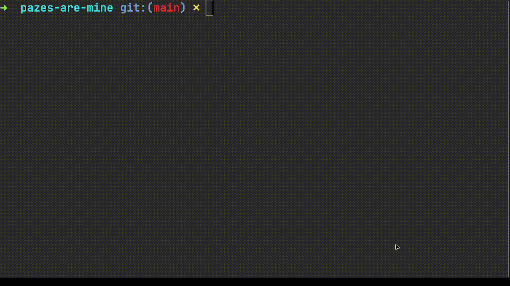

# 🌎 pazes-are-mine
Mass pages.dev based subdomain acquirer.

<p style="text-align: center">

</p>

## 🤓 Reason
Got nearly phished by one of fellow hacker. So I [acquired some popular pages.dev](https://github.com/rohitaryal/domain-acquired-notice)
subdomains to protect myself and people around me
from getting phished.

## ⚽ Usage
>[!TIP] You will need a list of sub-domain ([example](./files/domains.txt)) and the script will acquire them automatically if they are available.

```bash
git clone https://github.com/rohitaryal/pazes-are-mine
cd pazes-are-mine
node src/script.mjs
```